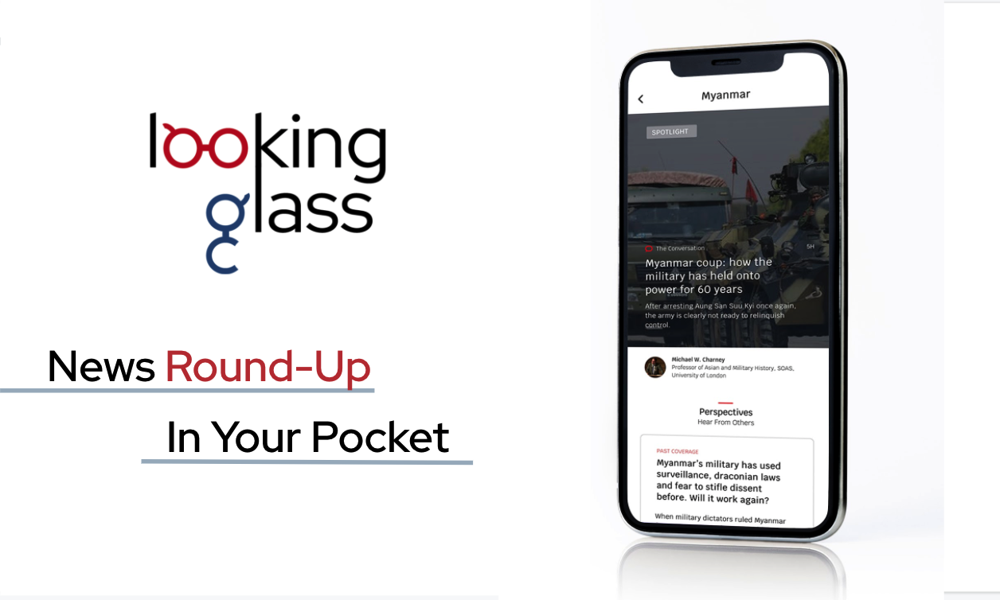
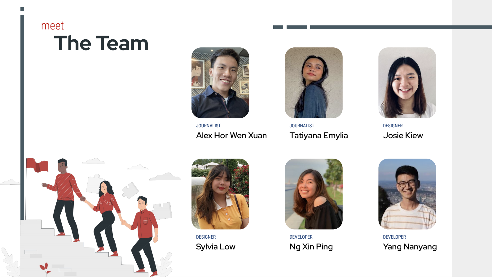

# LookingGlass - Curated News Roundup in your pocket
LookingGlass is a standalone webpage generation tool that allows news organisation to better provide mobile-friendly news reading experience and alleviate news fatigue for busy young adults by curated topic pages and multiple perspectives. 

# Table of Content

1. Introduction 
2. Requirements and setup
3. Usage
4. Future Iterations
5. Acknowledgements
6. Team

# 1. Introduction

LookingGlass aims to:

1. Alleviate news fatigue for busy young adults
2. Improve reading experience on mobiles
3. Allow news organisation to customise curated content for their readers

# 2. Requirements and Setup

The app is hosted in vercel server, no additional download is required, just follow the step to generate the web page on [https://looking-glass.vercel.app/](https://looking-glass.vercel.app/)

# 3. Usage

### Guide to create looking glass page

### Scan to experience the LookingGlass

## Features

- Curated Contents: News editorial team can curate content depend on their needs and readers' interest
- Multiple perspectives and content format on the issue
    1. **main article** feature
    2. **past coverage** on the related issue covered by the same news organisation (only pertaining for our anchored news organisation)
    3. **twitter embedding** to enhance the timeliness of the issue and allow further topic engagement to social media
    4. **global coverage** (optional) to search for related coverage by other news organisation
    5. **Video coverage** to provide a different media to interact with the content or topic featured

# 4. Future Iterations

We hope to improve the product through further iterations:

- **Selective global coverage**

    Currently the global coverage is done through google news search without any content filtering from a particular news organisation. It would be good if we can display only desired news partners' content

- **History of Roundup**

    To enable an archive function for readers to refer to past LookingGlass page of the same news oragnisation

- Bookmark and Sharing of Looking Glass link

    The ability to allow the readers to easily bookmark the page url and share the link via social media networking is crucial to promote the tool and acquire more readers.

# 5. Acknowlegements

[Ms Jessica Tan](https://www.linkedin.com/in/jessica-tan-530594/) and [Miss Joan Kelly](https://www.linkedin.com/in/joan-marie-kelly-a2068a5/) for their guidance throughout the News Media Lab course.

Our news partner [Ika Krismantari](https://www.linkedin.com/in/ika-krismantari-9051b0101/) and  [Prodita Sabarini](https://www.linkedin.com/in/prodita-sabarini-71792929/) @ The Conversation Indonesia for their continuous support and valuable feedback.

Our industry mentor [Harish Pillay](https://www.linkedin.com/in/harishpillay/) from Red Hat for his expert guidance.

Users from our research process, for providing us with insightful comments and feedback.

# 6. Team Members

**Journalists**: [Alex Hor Wen Xua](https://www.linkedin.com/in/alexwenxuan/)n  and [Tatiyana Emylia](https://www.linkedin.com/in/tatiyana-emylia/) 

**Designers**: [Josie Kiew](https://www.linkedin.com/in/josiekiew/) and [Sylvia Low](https://www.linkedin.com/in/sylvia-low/)

**Developer**: [Ng Xin Ping](https://www.linkedin.com/in/xin-ping-n62020b/) and [Yang Nanyang](https://www.linkedin.com/in/yang-nanyang/)
